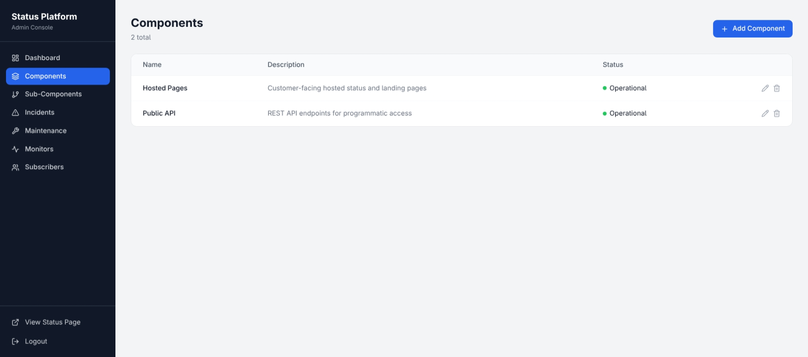
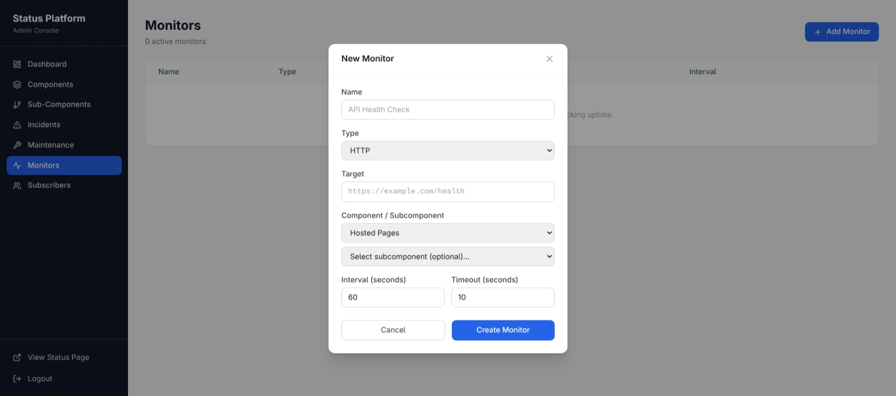
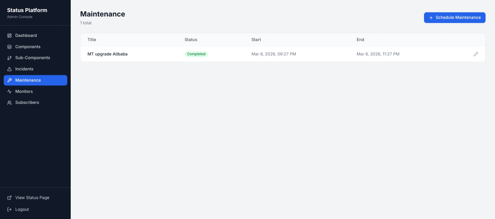

# StatusForge

A production-ready, self-hosted status page and monitoring platform similar to Atlassian Statuspage, BetterStack, and UptimeRobot. Single-tenant, fully open-source.

This unified server combines API, Worker, and embeds Web frontend in a single binary using goroutines.

## Features

- **Public Status Page** — Atlassian-style status page with 90-day uptime history bars, active incidents, and scheduled maintenance
- **Expandable Incident Timeline** — Public viewers can expand incident cards to see the full update history with status transitions (investigating, identified, monitoring, resolved). Works for both active and resolved incidents.
- **Admin CMS Dashboard** — Manage components, incidents, maintenance windows, monitors, and subscribers
- **Automated Monitoring** — HTTP, TCP, DNS, and ICMP ping checks with configurable intervals
- **Auto Incident Management** — Automatically creates incidents after 3 consecutive failures and auto-resolves when healthy
- **Real-time Updates** — WebSocket push for instant status changes without page refresh
- **Email Subscribers** — Collect and manage subscriber emails for status notifications
- **JWT Authentication** — Secure admin-only routes with bcrypt password hashing
- **90-Day Uptime History** — Daily uptime aggregation with color-coded bars per component
- **Single Container Deployment** — Unified binary in a single Docker container

### Incident Timeline Feature

The incident timeline feature provides full transparency to your users:

- **Active Incidents**: Each active incident card shows a chevron button to expand/collapse the timeline
- **Resolved Incidents**: The Incident History section shows resolved incidents with expandable timelines
- **Timeline Updates**: Each update displays the status (Investigating, Identified, Monitoring, Resolved), message, and timestamp
- **Visual Timeline**: Updates appear as a vertical timeline with a left border for clear visual hierarchy
- **Real-time Sync**: Timeline updates are pushed via WebSocket, so public viewers see updates instantly

## Tech Stack

| Layer | Technology |
|-------|-----------|
| Backend API | Go 1.21, Gin, JWT, bcrypt |
| Monitoring Worker | Go, goroutines, ICMP/TCP/DNS/HTTP with graceful shutdown |
| Frontend | React 18, Vite, TypeScript, Tailwind CSS (embedded in Go binary) |
| Database | MongoDB 7 |
| Cache / Pub-Sub | Redis |
| Real-time | WebSocket (gorilla/websocket) |
| Deployment | Single Docker Image |

## Architecture

StatusForge consolidates what would traditionally be 3 separate services (API, Worker, Web) into a single binary:

### Backend

- **Unified Server** (`cmd/server/main.go`) runs all services concurrently in goroutines
- **Embedded Frontend** statically served from within the Go binary
- **Toggleable Worker** enabled/disabled via `ENABLE_WORKER` environment variable
- **Graceful Shutdown** with 30s timeout and proper goroutine cleanup

### Frontend

- **React 18 SPA** built with Vite and TypeScript
- **Tailwind CSS** for styling with a clean, professional design
- **Component-based Architecture** with reusable UI elements
- **Real-time Updates** via WebSocket connection hook

### Database

- **MongoDB 7** for persistent storage
- **Collections**: components, subcomponents, incidents, incident_updates, monitors, maintenance, subscribers, admins, daily_uptime
- **Indexed Queries** for efficient incident and component lookups

### Cache

- **Redis** for session management and pub/sub messaging
- **WebSocket Hub** manages real-time client connections
- **Event Broadcasting** for component, incident, and monitor updates

## Screenshots

### Public Status Page


Clean, professional status page showing component health and incident history with expandable incident timelines.

### Admin Dashboard


Main admin interface with navigation and quick overview.

### Component Management


Create and manage components and their sub-components.

### Incident Timeline


Full incident lifecycle with status updates and timeline in the admin panel.

### Monitoring Overview


Real-time monitoring status and uptime metrics.

### Maintenance Scheduling


Schedule and manage planned maintenance windows.

## Dependencies

- **Backend**: Go 1.21+
- **Database**: MongoDB 7+
- **Cache**: Redis
- **Frontend**: React 18, Vite, TypeScript, Tailwind CSS
- **DevOps**: Docker, Docker Compose

## Platforms Supported

- Linux
- macOS
- Windows (via WSL)

## Key Directories

- `cmd/server/` - Main server executable
- `internal/` - Core application code
  - `database/` - Database connection logic
  - `handlers/` - API request handlers
  - `middleware/` - Authentication middleware
  - `models/` - Data models
  - `server/` - Server initialization logic
  - `embed/` - Embedded frontend assets
- `apps/web/` - React frontend
  - `src/components/` - Reusable UI components (IncidentTimeline, UptimeTimeline, etc.)
  - `src/pages/` - Page components (StatusPage, Admin pages)
  - `src/hooks/` - Custom React hooks (useApi, useWebSocket)
  - `src/lib/` - Utility functions and constants
- `configs/` - Configuration management
- `scripts/` - Utility scripts (seed.go for sample data)

## Environment Variables

| Variable | Description | Default |
|----------|-------------|---------|
| PORT | Server listening port | "8080" |
| MONGO_URI | MongoDB connection string | "mongodb://localhost:27017/statusplatform" |
| MONGO_DB | Database name | "statusplatform" |
| REDIS_ADDR | Redis connection address | "localhost:6379" |
| REDIS_PASSWORD | Redis password | "" |
| JWT_SECRET | Secret for JWT generation | "change-this-to-a-long-random-secret-in-production" |
| ADMIN_EMAIL | Default admin email | "admin@statusplatform.com" |
| ADMIN_PASSWORD | Default admin password | "admin123" |
| ADMIN_USERNAME | Default admin username | "admin" |
| ENABLE_WORKER | Enable monitoring worker | "true" |

## API Endpoints

### Public Endpoints (No Auth Required)

| Method | Endpoint | Description |
|--------|----------|-------------|
| GET | `/api/status/summary` | Overall platform status summary |
| GET | `/api/status/components` | All components with status, sub-components, and uptime history |
| GET | `/api/status/incidents` | Active and resolved incidents with full update timelines |
| POST | `/api/subscribe` | Subscribe email for notifications |
| GET | `/health` | Health check with database connectivity info |
| GET | `/` | Static React frontend |
| GET | `/ws` | WebSocket connection for real-time updates |

### Public Incident Endpoint Details

The `/api/status/incidents` endpoint returns incidents with their full update history:

```json
{
  "active": [
    {
      "id": "...",
      "title": "API Latency Issues",
      "description": "We are investigating reports of increased API latency.",
      "status": "investigating",
      "impact": "minor",
      "affectedComponents": ["..."],
      "createdAt": "2024-01-15T10:00:00Z",
      "updatedAt": "2024-01-15T10:30:00Z",
      "updates": [
        {
          "id": "...",
          "incidentId": "...",
          "status": "investigating",
          "message": "We are investigating reports of increased API latency.",
          "createdAt": "2024-01-15T10:00:00Z"
        }
      ]
    }
  ],
  "resolved": [
    {
      "id": "...",
      "title": "Elevated API error rates",
      "description": "We observed elevated error rates on the Public API.",
      "status": "resolved",
      "impact": "minor",
      "createdAt": "2024-01-14T08:00:00Z",
      "resolvedAt": "2024-01-14T12:00:00Z",
      "updates": [
        {
          "status": "investigating",
          "message": "We are investigating reports of elevated error rates.",
          "createdAt": "2024-01-14T08:00:00Z"
        },
        {
          "status": "identified",
          "message": "The issue has been identified as a misconfigured rate limiter.",
          "createdAt": "2024-01-14T09:00:00Z"
        },
        {
          "status": "monitoring",
          "message": "A fix has been deployed. Monitoring for recovery.",
          "createdAt": "2024-01-14T11:00:00Z"
        },
        {
          "status": "resolved",
          "message": "All systems are operating normally.",
          "createdAt": "2024-01-14T12:00:00Z"
        }
      ]
    }
  ]
}
```

### Protected Endpoints (JWT Required)

| Method | Endpoint | Description |
|--------|----------|-------------|
| POST | `/api/auth/login` | Authenticate admin user |
| GET | `/api/auth/me` | Get current authenticated user info |

#### Components

| Method | Endpoint | Description |
|--------|----------|-------------|
| GET | `/api/components` | Get all components |
| POST | `/api/components` | Create component |
| PATCH | `/api/components/:id` | Update component |
| DELETE | `/api/components/:id` | Delete component |
| GET | `/api/components/:id/subcomponents` | Get subcomponents for a component |

#### Subcomponents

| Method | Endpoint | Description |
|--------|----------|-------------|
| GET | `/api/subcomponents` | Get all subcomponents |
| POST | `/api/subcomponents` | Create subcomponent |
| PATCH | `/api/subcomponents/:id` | Update subcomponent |

#### Monitoring

| Method | Endpoint | Description |
|--------|----------|-------------|
| GET | `/api/monitors` | Get all monitors |
| POST | `/api/monitors` | Create monitor |
| DELETE | `/api/monitors/:id` | Delete monitor |
| GET | `/api/monitors/:id/logs` | Get monitor check logs |
| GET | `/api/monitors/:id/uptime` | Get 90-day uptime history |
| GET | `/api/monitors/:id/history` | Get enhanced monitor logs |
| GET | `/api/monitors/outages` | Get all outage records |

#### Incidents

| Method | Endpoint | Description |
|--------|----------|-------------|
| GET | `/api/incidents` | Get all incidents (optional `?status=active` filter) |
| POST | `/api/incidents` | Create incident |
| PATCH | `/api/incidents/:id` | Update incident |
| POST | `/api/incidents/:id/update` | Add incident update to timeline |
| GET | `/api/incidents/:id/updates` | Get incident update timeline |

#### Maintenance

| Method | Endpoint | Description |
|--------|----------|-------------|
| GET | `/api/maintenance` | Get all maintenance windows |
| POST | `/api/maintenance` | Create scheduled maintenance |
| PATCH | `/api/maintenance/:id` | Update maintenance window |

#### Subscribers

| Method | Endpoint | Description |
|--------|----------|-------------|
| GET | `/api/subscribers` | Get all subscribers |
| DELETE | `/api/subscribers/:id` | Delete subscriber |

### WebSocket Events

The WebSocket connection at `/ws` broadcasts these event types:

| Event Type | Trigger |
|------------|---------|
| `component_created` | New component added |
| `component_updated` | Component status changed |
| `incident_created` | New incident opened |
| `incident_updated` | Incident details modified |
| `incident_resolved` | Incident marked as resolved |
| `incident_update_added` | New timeline update added |

## How the Public Status Page Shows Incident Timelines

The public status page (`StatusPage.tsx`) renders incident timelines with an expandable UI:

### Active Incidents Section

Active incidents appear at the top of the page in red-bordered cards:

1. Each incident card displays title, description, status, impact, and start time
2. A chevron button (ChevronDown/ChevronUp) toggles the timeline visibility
3. When expanded, the `IncidentTimeline` component renders all updates chronologically

### Resolved Incidents Section

The Incident History section shows resolved incidents from the past 30 days:

1. Each incident displays a green "Resolved" badge
2. Shows created date and resolved date
3. Expandable timeline shows the full incident progression

### Timeline Component

The `IncidentTimeline` component renders updates as:

```
├── Investigating - "We are investigating..." (Jan 15, 10:00 AM)
├── Identified - "The root cause has been..." (Jan 15, 10:30 AM)
├── Monitoring - "A fix has been deployed..." (Jan 15, 11:00 AM)
└── Resolved - "All systems operational." (Jan 15, 12:00 PM)
```

### Incident Status Flow

Incidents progress through these statuses:

1. **Investigating** — Initial report, team is looking into the issue
2. **Identified** — Root cause has been found
3. **Monitoring** — Fix deployed, watching for stability
4. **Resolved** — Issue fully resolved

### Impact Levels

| Impact | Description |
|--------|-------------|
| None | No user impact |
| Minor | Small subset of users affected |
| Major | Significant user impact |
| Critical | Service completely unavailable |

## Running Mode

### Development

- Frontend: React development server with hot reloading (`npm run dev`)
- Backend: Go server with live reload
- Both services must run separately

### Production

- Built-in React frontend served from within the Go binary
- Single Go binary handles API, Web UI, and websocket connections
- Automated monitoring performed by integrated worker
- Deploy as a single container with MongoDB and Redis side-car

## Quick Start

### Prerequisites

- Docker and Docker Compose

### 1. Prepare your configuration

```bash
cp .env.example .env
# Edit .env if you want to change defaults
```

### 2. Run the unified platform

```bash
docker compose up --build
```

This starts:
- **Server** on port `8080` — serves API, WebSocket, and embedded Web frontend
- **MongoDB** on port `27017`
- **Redis** on port `6379`

### 3. (Optional) Seed sample data

```bash
# After services are running
go run scripts/seed.go
```

This creates sample components, subcomponents, and a resolved incident with a full timeline demonstrating the expandable incident update feature.

### 4. Access the platform

| URL | Description |
|-----|-------------|
| http://localhost:8080 | Public status page (served from embedded frontend) |
| http://localhost:8080/admin/login | Admin login |
| http://localhost:8080/api | API base |

**Default admin credentials:**
```
Email:    admin@statusplatform.com
Password: admin123
```

> Change these in `.env` before deploying to production.

## Health Check

The server exposes a health check endpoint to verify database connectivity:

- `GET http://localhost:8080/health`
- Returns 200 if healthy, 503 if MongoDB or Redis are unreachable
- Response includes detailed DB connectivity status

## Deployment

StatusForge is designed for containerized deployment:

- Single Docker image containing both server and static frontend assets
- Docker Compose configuration for orchestrating with MongoDB and Redis
- Production-optimized build process with static embedding
- Graceful shutdown handling for container orchestrators
- Healthcheck built into the image

## Design Philosophy

StatusForge follows the principle of "single-binary simplicity" where traditionally separate services (API backend, frontend web server, monitoring daemon, worker tasks) are combined into a single executable for easier deployment and management. It uses Go's concurrency model via goroutines to handle multiple long-running processes.

## Contributing

1. Fork the repository
2. Create a feature branch (`git checkout -b feature/amazing-feature`)
3. Make your changes
4. Add tests if applicable
5. Commit your changes (`git commit -m 'Add amazing feature'`)
6. Push to the branch (`git push origin feature/amazing-feature`)
7. Open a Pull Request

## License

MIT