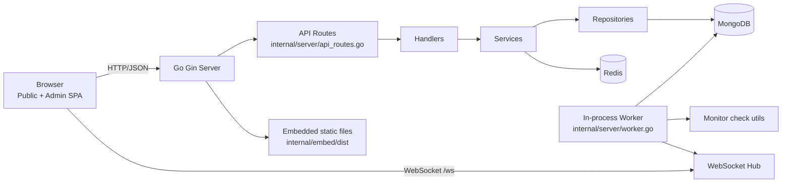

# StatusForge

StatusForge is a self-hosted status page and infrastructure monitoring platform. It combines a Go (Gin) API server, an embedded React frontend, a worker loop for active checks, and a public status page with real-time updates.

## Table of Contents

- [Overview](#overview)
- [Features](#features)
- [Screenshots](#screenshots)
- [Architecture Diagram](#architecture-diagram)
- [Tech Stack](#tech-stack)
- [Project Structure](#project-structure)
- [Setup](#setup)
- [Configuration](#configuration)
- [Monitoring and Worker Model](#monitoring-and-worker-model)
- [Roadmap](#roadmap)
- [Contributing](#contributing)
- [License](#license)

## Overview

StatusForge is designed for teams that want to run their own status platform and keep control of runtime, data, and integrations. The server exposes API routes and WebSocket events, serves an embedded SPA build, seeds an initial admin user from environment variables, and can run a background monitor worker in-process.

## Features

- Public status page with component and subcomponent health
- Incident lifecycle management with incident updates
- Scheduled and active maintenance publishing
- Active monitor checks (HTTP, TCP, DNS, Ping, SSL)
- SSL certificate and domain expiry warning support in monitor flow
- Role-aware admin area (`admin`, `operator`) with MFA-gated routes
- JWT-authenticated API for protected operations
- WebSocket push events for near real-time UI refresh
- Subscriber management and webhook channel management
- Status page branding and settings management

## Screenshots

StatusForge includes documentation images under `docs/screenshots/`.

| Public Status Page | Admin Dashboard | Admin Setting |
|---|---|---|
|  |  |  |

| Incident History| Monitoring | Maintenance | Service Info |
|---|---|---|---|
|  |  |  |  |

## Architecture Diagram



Detailed architecture documentation is available at [`docs/architecture.md`](docs/architecture.md).

## Tech Stack

- **Backend language/runtime**: Go 1.26
- **HTTP framework**: Gin
- **Auth tokens**: JWT (`github.com/golang-jwt/jwt/v5`)
- **Realtime**: Gorilla WebSocket
- **Primary database**: MongoDB
- **Cache / auxiliary store**: Redis
- **Frontend**: React 18 + TypeScript + Vite
- **Styling**: Tailwind CSS
- **Containerization**: Docker multi-stage build + Docker Compose

## Project Structure

```text
.
├── cmd/server/main.go                 # Process entrypoint
├── internal/server/                   # Server bootstrap, routes, worker, static serving
├── internal/handlers/                 # HTTP + websocket handlers
├── internal/services/                 # Application service layer
├── internal/repository/               # Data access layer
├── internal/database/                 # MongoDB/Redis connection setup
├── internal/middleware/               # JWT, MFA, role middleware
├── internal/models/                   # Domain and persistence models
├── internal/embed/                    # Embedded frontend assets (dist)
├── apps/web/                          # React SPA source
├── configs/config.go                  # Environment-driven config loader
├── Dockerfile                         # Multi-stage frontend+backend build
├── docker-compose.yml                 # Server + Mongo + Redis stack
└── docs/                              # Architecture and image docs
```

## Setup

### Prerequisites

- Docker + Docker Compose (recommended path)
- Or for local non-container execution:
  - Go 1.26+
  - Node.js 20+
  - MongoDB
  - Redis

### Quick Start (Docker Compose)

```bash
git clone https://github.com/fresp/StatusForge.git
cd StatusForge
cp .env.example .env
docker compose up --build
```

Application endpoints:

- Public status page: `http://localhost:8080/`
- Admin app: `http://localhost:8080/admin`
- Health check: `http://localhost:8080/health`
- WebSocket endpoint: `ws://localhost:8080/ws`

Default bootstrap admin values come from `.env.example`:

- `ADMIN_EMAIL=admin@statusplatform.com`
- `ADMIN_USERNAME=admin`
- `ADMIN_PASSWORD=admin123`

Change these immediately in any persistent/shared environment.

### Local Development (without Docker)

Backend:

```bash
cp .env.example .env
go mod download
go run cmd/server/main.go
```

Frontend (optional separate dev server):

```bash
cd apps/web
npm install
npm run dev
```

The production-like server path serves embedded frontend assets via `NoRoute` static fallback; the separate Vite server is mainly for frontend iteration.

### Build Commands

Frontend build:

```bash
cd apps/web
npm run build
```

Backend build:

```bash
go build -o server cmd/server/main.go
```

### Makefile Shortcuts

```bash
make up
make up-build
make down
make logs
make logs-server
make ps
```

## Configuration

Environment variables are loaded via `configs.Load()`.

| Variable | Default | Purpose |
|---|---|---|
| `MONGODB_URI` | `mongodb://localhost:27017` | MongoDB connection string |
| `MONGODB_DB` | `statusplatform` | MongoDB database name |
| `REDIS_URI` | `localhost:6379` | Redis address |
| `JWT_SECRET` | `super-secret-jwt-key-change-in-production` | JWT HMAC secret |
| `MFA_SECRET_KEY` | empty | MFA secret material |
| `PORT` | `8080` | HTTP listen port |
| `ADMIN_EMAIL` | `admin@statusplatform.com` | Bootstrap admin email |
| `ADMIN_PASSWORD` | `admin123` | Bootstrap admin password |
| `ADMIN_USERNAME` | `admin` | Bootstrap admin username |
| `ENABLE_WORKER` | `true` | Enable in-process monitor worker |
| `GRACEFUL_SHUTDOWN` | `true` | Enable signal-based shutdown flow |
| `SHUTDOWN_TIMEOUT` | `30` | Shutdown timeout in seconds |

## Monitoring and Worker Model

When `ENABLE_WORKER=true`, the server starts an internal monitor worker loop.

- Worker ticker fires every 10 seconds.
- Effective monitor interval defaults to 60 seconds if not set.
- Monitor checks supported in current worker code:
  - HTTP
  - TCP
  - DNS
  - Ping
  - SSL
- Check output is written to:
  - `monitor_logs`
  - monitor status fields (`lastStatus`, warning fields, `lastCheckedAt`)
- Worker also triggers:
  - daily uptime updates
  - outage detection logic
  - maintenance status updates

## Roadmap

- Harden production WebSocket and CORS policy defaults
- Expand API reference with OpenAPI/Swagger artifacts
- Add dedicated worker deployment mode for horizontal scaling
- Extend observability surface (structured metrics and tracing)

## Contributing

Contributions are welcome.

1. Fork the repository.
2. Create a feature branch.
3. Run project checks.
4. Open a pull request with clear scope and validation notes.

## License

Licensed under the [MIT License](LICENSE).
