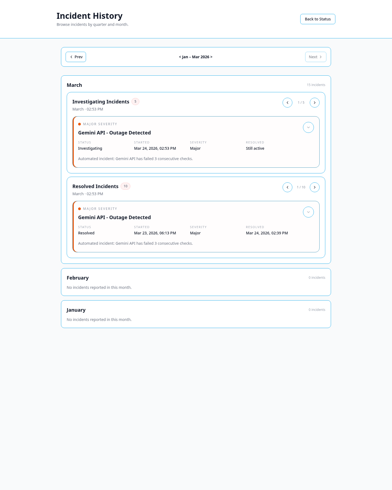
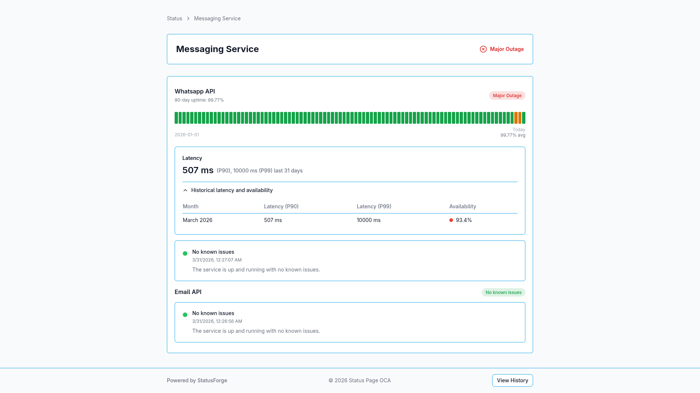
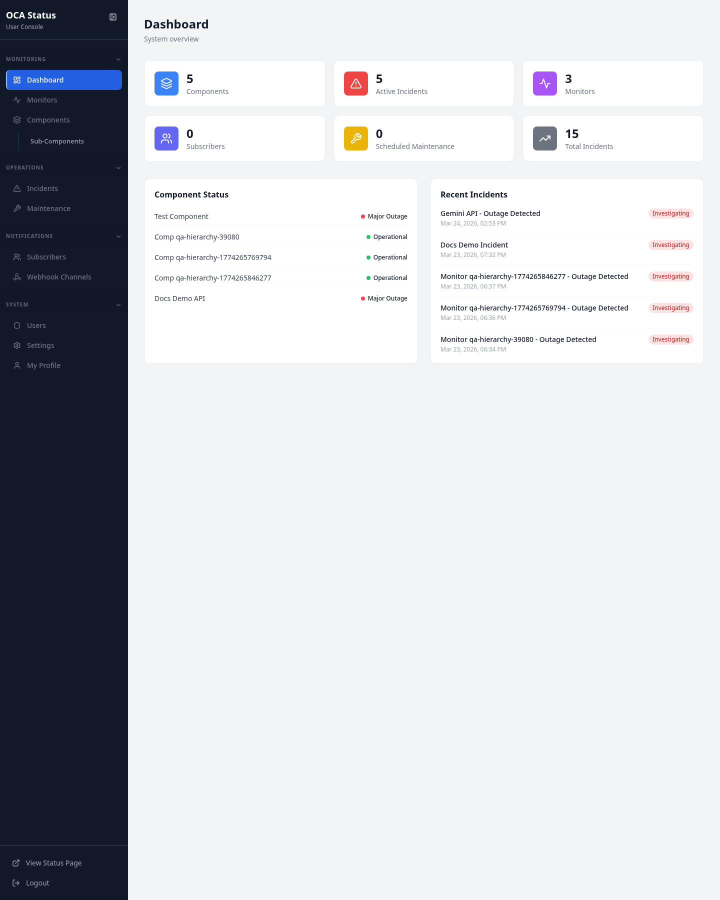

# Statora


Statora is a self-hosted status page and uptime monitoring platform.

It helps you monitor services, publish incidents, schedule maintenance, and share real-time status updates from one place.

## Overview

The name Statora is derived from the ideas of “state” and “awareness/orchestration”, reflecting its role as a central system that continuously understands service conditions and turns them into clear, reliable communication.

With Statora, you can:

- Show a clean public status page for your services
- Track incidents and post updates as things happen
- Schedule planned maintenance ahead of time
- Monitor endpoints and infrastructure from one dashboard
- Manage everything from a dedicated admin area
- Self-host the platform in your own environment

## Feature Highlights

### Public Status Experience
- Public-facing status page for services, components, and subcomponents
- Incident history for transparent communication over time
- Service detail views with uptime and status context
- Real-time updates for a more responsive status experience

### Incident & Maintenance Management
- Create, update, and resolve incidents from the admin area
- Publish scheduled maintenance to prepare users in advance
- Keep status communication centralized and consistent

### Monitoring & Reliability
- Built-in active monitoring for HTTP, TCP, DNS, Ping, and SSL checks
- Warning support for SSL and domain expiry monitoring flows
- Worker-driven status updates tied to monitoring results

### Administration & Access Control
- Dedicated admin dashboard for operational management
- Role-aware access for `admin` and `operator`
- MFA-aware protected flows for sensitive actions
- Centralized settings for branding and platform behavior

### Realtime & Integrations
- WebSocket-powered live refresh for key status updates
- Webhook channel management
- Subscriber management for status communication workflows

## Screenshots

### Public Experience

| Status Page | Incident History | Service Details |
|---|---|---|
|  |  |  |

### Admin Experience

| Dashboard | Monitoring | Maintenance | Settings |
|---|---|---|---|
|  |  |  |  |

## What You Can Do

- Run a public-facing status page
- Manage incidents and maintenance in one place
- Monitor services with active checks
- Keep internal operators and external users aligned
- Self-host your uptime and status workflow

## Quick Start

The fastest way to run Statora locally is with Docker Compose.

### Run with Docker Compose

```bash
git clone https://github.com/fresp/Statora.git
cd Statora
cp .env.example .env
docker compose up --build
```

### Default Local Endpoints

- Public status page: `http://localhost:8080/`
- Admin area: `http://localhost:8080/admin`
- Health endpoint: `http://localhost:8080/health`

### Default Bootstrap Admin

Values come from `.env.example`:

- `ADMIN_EMAIL=admin@statusplatform.com`
- `ADMIN_USERNAME=admin`
- `ADMIN_PASSWORD=admin123`

Change these immediately for any shared or persistent environment.

## Tech Stack

- **Backend:** Go, Gin
- **Frontend:** React, TypeScript, Vite
- **Database:** MongoDB
- **Cache / supporting store:** Redis
- **Realtime:** Gorilla WebSocket
- **Authentication:** JWT with MFA-aware access flow
- **Deployment:** Docker, Docker Compose

## Self-Hosted by Design

Statora is designed to give teams control over their status workflow, monitoring setup, and public communication without depending on a hosted third-party service.

## Roadmap

Planned improvements include:

- stronger production hardening for realtime and CORS behavior
- richer API and developer documentation
- more scalable worker deployment patterns
- broader observability support

## Contributing

Contributions are welcome. Open an issue or submit a pull request with a clear scope and validation notes.

## License

Licensed under the [MIT License](LICENSE).
