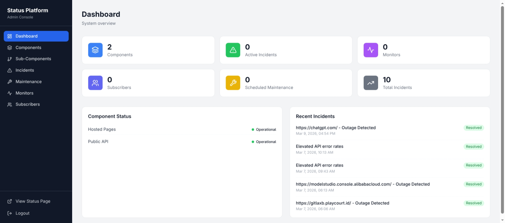
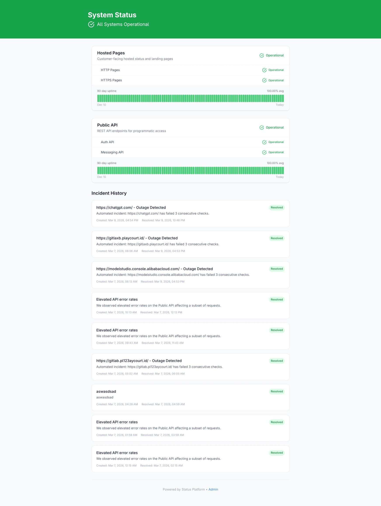
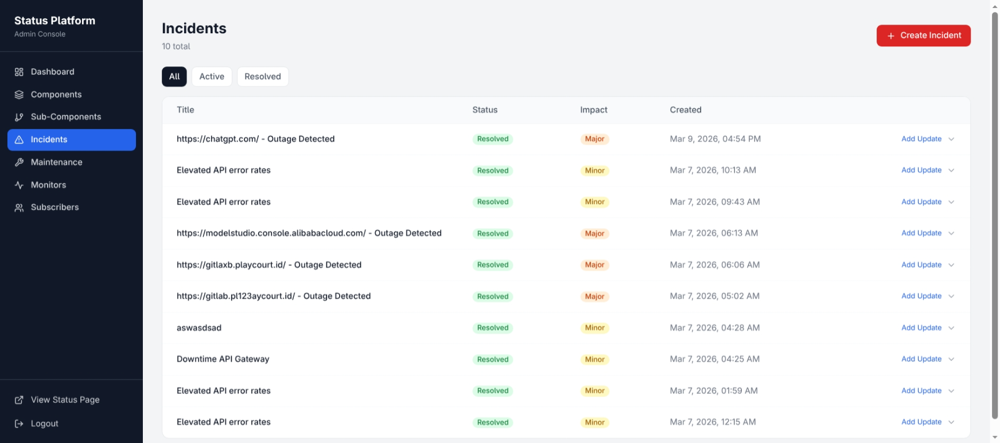

# StatusForge

An open-source, self-hosted status page platform for monitoring services and managing incidents.

---

## Features

- **Service Monitoring** - Track the status of your services in real-time
- **Incident Management** - Create, update, and resolve incidents with timelines
- **Role-Based Admin Access** - Enforce RBAC with `admin` and `operator` roles on admin APIs
- **Operator Scope Enforcement** - Limit operator access to incidents and maintenance workflows
- **Public Status Page** - Share service status with your users
- **Real-time Updates** - WebSocket-powered live updates
- **Members & Invitations Split View** - Manage active members and pending invitations in separate admin sections
- **Self-hosted** - Full control over your data and infrastructure
- **Lightweight Architecture** - Simple Go backend with React frontend
- **Webhook Notification Channels** - Configure webhooks to receive incident and maintenance updates
- **Custom Status Page Themes and Settings** - Customize the look and feel of your public status page

---

## Screenshots

| Dashboard | Public Status Page | Incident Timeline |
|-----------|-------------------|-------------------|
|  |  |  |

---

## Quick Start

The fastest way to run StatusForge:

```bash
docker-compose up --build
```

Access the platform:
- **Status page**: http://localhost:8080
- **Admin panel**: http://localhost:8080/admin

Default credentials:
```
Email: admin@statusplatform.com
Password: admin123
```

> ⚠️ Change the default credentials in production!

---

## Tech Stack

**Backend**
- Go
- Gin
- MongoDB
- Redis

**Frontend**
- React
- Vite
- Tailwind CSS

---

## Local Development

### Prerequisites

- Go 1.21+
- Node.js 20+
- MongoDB
- Redis

### Setup

1. **Clone the repository**
   ```bash
   git clone https://github.com/fresp/StatusForge.git
   cd StatusForge
   ```

2. **Configure environment**
   ```bash
   cp .env.example .env
   ```

   Edit `.env` with your settings.

3. **Run backend**
   ```bash
   go run cmd/server/main.go
   ```

   Module path: `github.com/fresp/StatusForge`

4. **Run frontend** (in a new terminal)
   ```bash
   cd apps/web
   npm install
   npm run dev
   ```

---

## Roadmap

- [ ] Multi-database support (PostgreSQL, MySQL)
- [x] Basic role-based multi-user admin system (admin/operator)
- [x] Notification channels (Email, Slack, Webhooks)
- [ ] Advanced monitoring checks (ICMP, SSL expiry)
- [x] Custom status page themes
- [ ] Maintenance window scheduling
- [ ] Analytics and reporting

---

## Contributing

Contributions are welcome!

- Report bugs and request features via [Issues](https://github.com/fresp/StatusForge/issues)
- Submit pull requests for bug fixes and improvements
- Help improve documentation

Detailed technical documentation is available in the [`/docs`](docs/) directory.

---

## License

[MIT](LICENSE)
