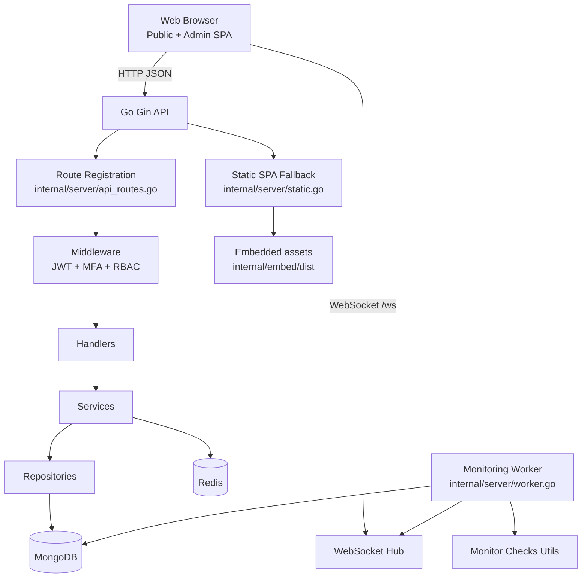

# Statora Architecture

This document describes the current architecture of Statora based on the present repository implementation.

## High-Level Diagram



## Layered Architecture

Statora is organized as a layered backend with an embedded frontend distribution:

1. **Entry and runtime bootstrap**
   - `cmd/server/main.go` starts `server.RunServer()`.
   - `internal/server/server.go` loads environment values, connects databases, initializes Gin, registers routes, starts hub and optionally worker.

2. **Transport and routing layer**
   - `internal/server/api_routes.go` configures CORS and all API route groups.
   - Health route at `/health`.
   - WebSocket endpoint at `/ws`.

3. **Security middleware layer**
   - `internal/middleware/auth.go` provides:
     - `AuthMiddleware` for JWT verification
     - `RequireMFAVerified`
     - `RequireRoles`

4. **Handler and application layer**
   - `internal/handlers/*` contains endpoint handlers and websocket hub logic.
   - `internal/services/*` encapsulates use-case/business flows.

5. **Data access layer**
   - `internal/repository/*` mediates MongoDB persistence operations.
   - `internal/database/mongo.go` and `internal/database/redis.go` create and expose clients.

6. **Frontend delivery layer**
   - React app source under `apps/web/`.
   - Built assets copied to `internal/embed/dist` during Docker build.
   - `internal/server/static.go` serves static assets and falls back to `index.html` for SPA routes.

## Runtime Data Flow

### Request path (HTTP)

1. Request enters Gin engine.
2. CORS middleware applies.
3. Route selection under `/api` or static fallback.
4. For protected routes: JWT auth middleware executes.
5. For privileged route groups: MFA and role middleware execute.
6. Handler invokes service/repository logic.
7. Data is read/written in MongoDB and, where needed, Redis.
8. JSON response returns to browser.

### Frontend flow

- Main frontend route map is in `apps/web/src/App.tsx`.
- Axios client in `apps/web/src/lib/api.ts` attaches bearer tokens from local storage.
- Admin UI route protection applies both token presence and MFA/role constraints.

## Realtime and Event Flow

Realtime updates are delivered using a WebSocket hub:

- Endpoint: `GET /ws`
- Hub implementation: `internal/handlers/websocket.go`
- Client hook: `apps/web/src/hooks/useWebSocket.ts`

Current frontend behavior on incoming events (from `StatusPage.tsx`):

- Component events trigger summary/component refresh.
- Incident events trigger incident and summary refresh.
- Status page settings updates are parsed, cached, and applied dynamically.

Hub internals:

- Tracks clients in memory.
- Broadcast channel fan-outs event payloads.
- Ping/pong and reconnect behavior are handled at transport/client level.

## Worker and Monitoring Flow

The monitoring worker runs in-process when enabled (`ENABLE_WORKER=true`).

- Ticker interval: 10s
- Due-check scheduling based on monitor interval (`default: 60s`)
- Monitor types currently checked in worker:
  - HTTP
  - TCP
  - DNS
  - Ping
  - SSL
- Additional warning logic:
  - SSL expiry warning thresholds
  - Domain expiry warning thresholds
- Side effects:
  - writes monitor logs
  - updates current monitor status fields
  - updates uptime/outage tracking
  - updates maintenance status

## Authentication and Authorization Model

Most administrative/profile API routes use bearer JWT tokens.

Claims include:

- `userId`
- `username`
- `role`
- `mfaVerified`

Authorization structure:

1. Authenticated group: requires valid JWT.
2. Verified group: requires `mfaVerified=true`.
3. Role groups:
   - `admin` only
   - `admin` or `operator`

Frontend route protection mirrors these constraints for admin navigation.

Route-group exception in current implementation:

- `GET /api/v1/monitors/:id/metrics` is registered directly under the base `/api` group in `internal/server/api_routes.go`, and is therefore not currently behind JWT, MFA, or role middleware.

## Deployment Topology (Current)

Primary deployment artifacts:

- `Dockerfile`: multi-stage build (frontend then backend)
- `docker-compose.yml`: server + MongoDB + Redis services

Notable runtime details:

- Server container runs as non-root user.
- Health check probes `/health`.
- Compose grants `NET_RAW` for ping monitor support.

## Architecture Decisions (Observed)

1. **Single unified server process**
   - API, static file serving, websocket hub, and optional worker are hosted in one process for operational simplicity.

2. **MongoDB as primary data store**
   - Flexible document schema aligns with component/incident/monitor domain objects.

3. **Redis included as supporting runtime dependency**
   - Connected during startup and available to runtime components.

4. **SPA embedding into backend binary/image**
   - Simplifies deployment by shipping frontend assets with backend server image.

5. **Layered access control (JWT + MFA + RBAC)**
   - Administrative actions are gated progressively with explicit middleware boundaries.

## Docs Tree

```text
docs/
├── architecture.md
├── images/
│   ├── README.md
│   ├── admin-component.png
│   ├── admin-dashboard.png
│   ├── admin-incident.png
│   ├── admin-maintenance.png
│   ├── admin-monitoring.png
│   └── public-statuspage.jpeg
├── plans/
└── screenshots/
```
