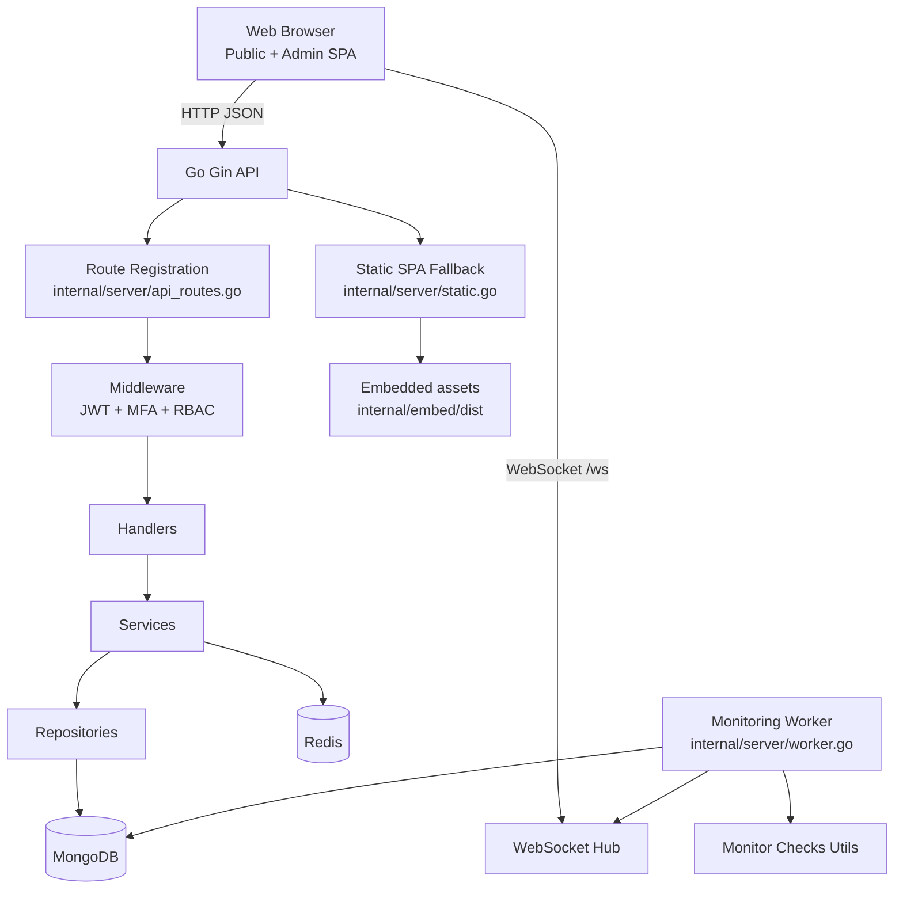

# Statora Architecture

This document describes the current architecture of Statora based on the present repository implementation.

## High-Level Architecture



## Layered Architecture

Statora is organized as a layered backend with an embedded frontend distribution:

### 1. Entry and Runtime Bootstrap
- `cmd/server/main.go` starts `server.RunServer()`
- `internal/server/server.go` loads environment values, connects databases, initializes Gin, registers routes, starts hub and optionally worker

### 2. Transport and Routing Layer
- `internal/server/api_routes.go` configures CORS and all API route groups
- Health route at `/health`
- WebSocket endpoint at `/ws`
- SSO callback at `/sso/callback`

### 3. Security Middleware Layer
- `internal/middleware/auth.go` provides:
  - `AuthMiddleware` for JWT verification (supports header or cookie)
  - `RequireMFAVerified` for MFA-gated routes
  - `RequireRoles` for role-based access control

### 4. Handler and Application Layer
- `internal/handlers/*` contains endpoint handlers and WebSocket hub logic
- `internal/services/*` encapsulates use-case/business flows

### 5. Data Access Layer
- `internal/repository/*` mediates MongoDB persistence operations
- `internal/database/mongo.go` and `internal/database/redis.go` create and expose clients

### 6. Frontend Delivery Layer
- React app source under `apps/web/`
- Built assets copied to `internal/embed/dist` during Docker build
- `internal/server/static.go` serves static assets and falls back to `index.html` for SPA routes

## Data Flow

### HTTP Request Path

1. Request enters Gin engine
2. CORS middleware applies (configured in `api_routes.go`)
3. Route selection under `/api` or static fallback
4. For protected routes: JWT auth middleware executes (extracts from header or `statora_auth` cookie)
5. For privileged route groups: MFA and role middleware execute
6. Handler invokes service/repository logic
7. Data is read and written in MongoDB; Redis is connected as a supporting runtime dependency and health-checked during startup/runtime
8. JSON response returns to browser

### Frontend Flow

- Main frontend route map is in `apps/web/src/App.tsx`
- Axios client in `apps/web/src/lib/api.ts` attaches bearer tokens from local storage
- Admin UI route protection mirrors backend constraints for navigation
- Token storage uses `localStorage` with `user_token` and `user_profile`, with compatibility cleanup for legacy `admin_token` and `admin_profile` keys

## Realtime and Event Flow

Realtime updates are delivered using a WebSocket hub:

- **Endpoint:** `GET /ws`
- **Hub implementation:** `internal/handlers/websocket.go`
- **Client hook:** `apps/web/src/hooks/useWebSocket.ts`

Current frontend behavior on incoming events (from `StatusPage.tsx`):

- Component events trigger summary/component refresh
- Incident events trigger incident and summary refresh
- Status page settings updates are parsed, cached, and applied dynamically

Hub internals:

- Tracks clients in memory with register/unregister channels
- Broadcast channel fan-outs event payloads to all connected clients
- Ping/pong (54s ticker, 60s read deadline) and reconnect behavior handled at transport/client level
- WebSocket upgrader buffer sizes are configured to 1024 bytes for both reads and writes

## Worker and Monitoring Flow

The monitoring worker runs in-process when enabled (`ENABLE_WORKER=true`):

- **Ticker interval:** 10 seconds, with overlapping cycles skipped if a previous cycle is still running
- **Due-check scheduling:** Based on monitor interval (default: 60s, configurable per monitor)
- **Monitor types:**
  - HTTP (with optional SSL cert and domain expiry checks)
  - TCP
  - DNS
  - Ping (requires `NET_RAW` capability)
  - SSL (dedicated SSL expiry monitoring)
- **Warning logic:**
  - SSL expiry warning thresholds (default: 30, 14, 7 days)
  - Domain expiry warning thresholds
- **Side effects:**
  - Writes monitor logs to `monitor_logs` collection
  - Updates current monitor status fields
  - Updates daily uptime tracking
  - Detects outages (after 3 consecutive failures)
  - Auto-creates incidents for detected outages when there is no existing active incident for the affected components
  - Updates maintenance status (scheduled, in-progress, completed)
  - Broadcasts events via WebSocket hub

## Authentication and Authorization Model

Most administrative/profile API routes use bearer JWT tokens.

JWT claims include:

- `userId` - User identifier
- `username` - User's username
- `role` - User role (`admin` or `operator`)
- `mfaVerified` - Whether MFA verification is complete

Token sources (in order of priority):

1. `Authorization: Bearer <token>` header
2. `statora_auth` cookie

Cookie handling notes:

- The backend sets `statora_auth` as an `HttpOnly`, `Secure`, `SameSite=Lax` cookie
- The frontend primarily stores auth state in `localStorage` and sends bearer tokens through the Axios client

Authorization structure:

1. **Authenticated group:** Requires valid JWT (`AuthMiddleware`)
2. **Verified group:** Requires `mfaVerified=true` (`RequireMFAVerified`)
3. **Role groups:**
   - `admin` only: Components, subcomponents, monitors, subscribers, settings, webhook channels, users
   - `admin` or `operator`: Incidents, maintenance, component reads

Frontend route protection mirrors these constraints for admin navigation:

- `/admin/incidents` and `/admin/maintenance` - accessible to both roles
- All other `/admin/*` routes - admin only
- MFA verification required before accessing protected routes (redirects to `/admin/profile`)

### Route Group Exceptions

- `GET /api/v1/monitors/:id/metrics` is registered directly under the base `/api` group, not behind JWT/MFA/role middleware
- Public status endpoints (`/api/status/*`, `/api/subscribe`) are unauthenticated

## SSO Integration

SSO callback flow:

1. External identity provider redirects to `/sso/callback?token=<jwt>`
2. Handler validates token via auth service
3. On success: sets `statora_auth` cookie and redirects to `/admin`
4. On failure: redirects to `/login?error=<code>` with error code

Error codes:
- `sso_not_configured` - SSO not set up
- `sso_disabled` - SSO disabled
- `user_not_found` - User does not exist
- `sso_not_allowed` - User not allowed for SSO
- `invalid_token` - Token validation failed

## Deployment Topology

Primary deployment artifacts:

- `Dockerfile`: Multi-stage build (frontend then backend)
  - Stage 1: Node 20 Alpine for frontend build
  - Stage 2: Go 1.26 Alpine for backend build
  - Stage 3: Alpine latest for runtime (non-root user)
- `docker-compose.yml`: Server + MongoDB + Redis services

Notable runtime details:

- Server container runs as non-root user (`appuser`, UID 1001)
- Health check probes `/health` every 30s
- Compose grants `NET_RAW` capability for ping monitor support
- Graceful shutdown support (configurable via `GRACEFUL_SHUTDOWN`)
- Worker can be disabled via `ENABLE_WORKER=false`

## Key Design Decisions

1. **Single unified server process**
   - API, static file serving, WebSocket hub, and optional worker are hosted in one process for operational simplicity
   - Simplifies deployment and reduces infrastructure complexity

2. **MongoDB as primary data store**
   - Flexible document schema aligns with component/incident/monitor domain objects
   - Native support for nested documents and arrays

3. **Redis as supporting runtime dependency**
   - Connected during startup and included in health checks
   - Present in the current runtime topology, but its application-level usage is minimal in the current implementation

4. **SPA embedding into backend binary/image**
   - Frontend built and copied to `internal/embed/dist` during Docker build
   - Simplifies deployment by shipping frontend assets with backend server image
   - Gin's `NoRoute` handler serves `index.html` for SPA routes

5. **Layered access control (JWT + MFA + RBAC)**
   - Administrative actions are gated progressively with explicit middleware boundaries
   - MFA verification is a separate gate from authentication
   - Role-based access allows operator-only users for incident management

6. **In-process worker**
   - Monitoring worker runs as goroutine within main server process
   - Eliminates need for separate worker deployment
   - Graceful shutdown coordination via context cancellation

## Frontend Architecture

### Tech Stack
- React 18 with TypeScript 5
- Vite 5 for build tooling
- React Router 6 for client-side routing
- Tailwind CSS 3 for styling
- Axios for API communication
- Lucide React for icons

### Route Structure

**Public routes:**
- `/` - Main status page
- `/status/:categoryPrefix` - Category-specific status
- `/history` - Incident history

**Admin routes (under `/admin`):**
- `/admin/login` - Login page
- `/admin/activate` - User activation
- `/admin/profile` - User profile and MFA setup
- `/admin` (index) - Dashboard (admin) or Incidents (operator)
- `/admin/components` - Component management (admin only)
- `/admin/subcomponents` - Subcomponent management (admin only)
- `/admin/incidents` - Incident management (admin/operator)
- `/admin/maintenance` - Maintenance management (admin/operator)
- `/admin/monitors` - Monitor management (admin only)
- `/admin/monitors/:id/logs` - Monitor logs (admin only)
- `/admin/subscribers` - Subscriber management (admin only)
- `/admin/webhook-channels` - Webhook configuration (admin only)
- `/admin/users` - User management (admin only)
- `/admin/settings` - Platform settings (admin only)

### State Management
- Authentication state stored in `localStorage`
- Profile data cached after `/auth/me` response
- WebSocket connection managed via React hook with automatic reconnection

## Project Structure

```
Statora/
├── cmd/
│   └── server/
│       └── main.go              # Entry point
├── internal/
│   ├── server/
│   │   ├── server.go            # Server bootstrap
│   │   ├── api_routes.go        # Route registration
│   │   ├── worker.go            # Monitoring worker
│   │   └── static.go            # Static file serving
│   ├── handlers/                # HTTP handlers
│   ├── middleware/              # Gin middleware
│   ├── services/                # Business logic
│   ├── repository/              # Data access
│   ├── database/                # DB connections
│   ├── models/                  # Data models
│   ├── utils/                   # Monitor check utilities
│   └── embed/dist/              # Embedded frontend assets
├── apps/
│   └── web/                     # React frontend
├── configs/                     # Configuration
├── docs/
│   ├── architecture.md          # This file
│   └── screenshots/             # Documentation images
├── Dockerfile
├── docker-compose.yml
├── Makefile
└── .env.example
```

## Environment Configuration

Key environment variables:

| Variable | Purpose | Default |
|----------|---------|---------|
| `MONGODB_URI` | MongoDB connection string | `mongodb://localhost:27017` |
| `MONGODB_DB` | Database name | `statusplatform` |
| `REDIS_URI` | Redis connection string | `localhost:6379` |
| `JWT_SECRET` | JWT signing key | `super-secret-jwt-key-change-in-production` |
| `APP_ENCRYPTION_KEY` | Email encryption key (must be exactly 32 bytes) | Required |
| `MFA_SECRET_KEY` | MFA encryption key | Empty by default |
| `PORT` | Server port | `8080` |
| `GRACEFUL_SHUTDOWN` | Enable graceful shutdown | `true` |
| `ENABLE_WORKER` | Start monitoring worker | `true` |
| `ADMIN_EMAIL` | Bootstrap admin email | `admin@statusplatform.com` |
| `ADMIN_USERNAME` | Bootstrap admin username | `admin` |
| `ADMIN_PASSWORD` | Bootstrap admin password | `admin123` |

## Security Considerations

- JWT tokens support both header and cookie-based delivery
- Auth cookies are set `HttpOnly`, `Secure`, and `SameSite=Lax`
- MFA required for sensitive operations after initial authentication
- Role-based access separates admin and operator capabilities
- Password hashing using bcrypt
- Email normalization and hashing for privacy
- CORS configured for wide compatibility (restrict in production)
- Non-root container execution
- Health endpoint for load balancer integration
